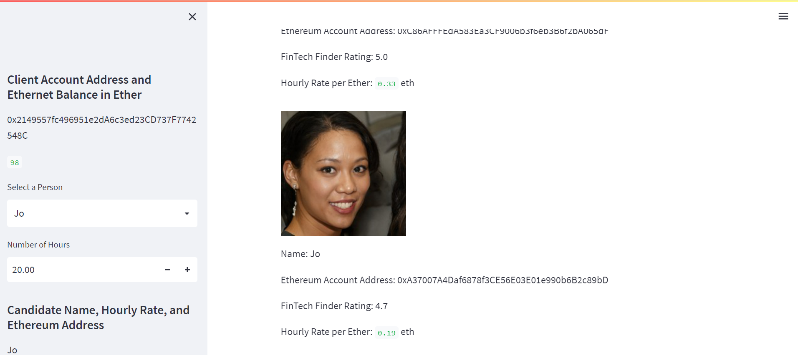
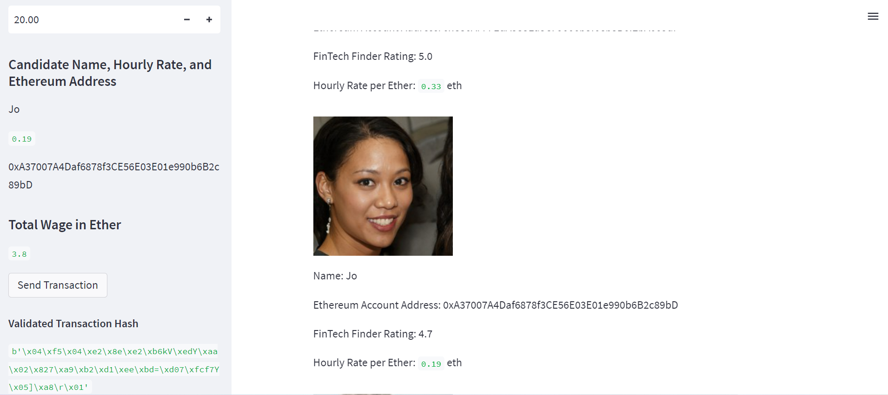
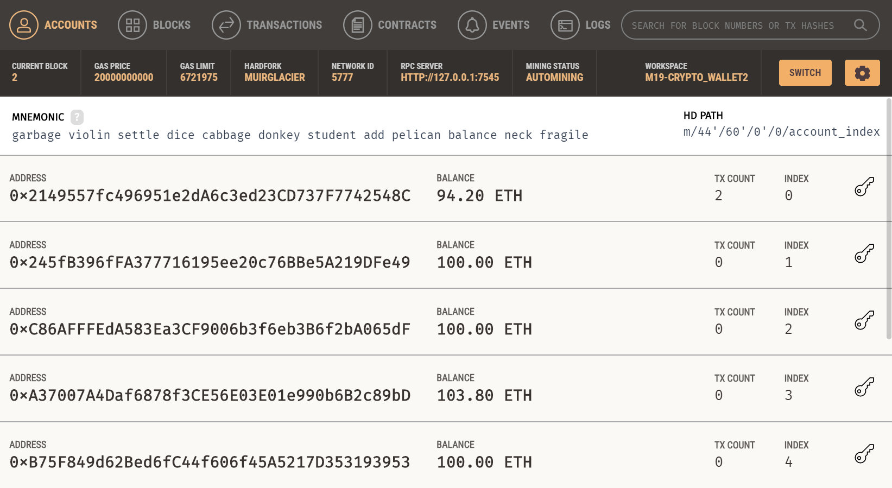
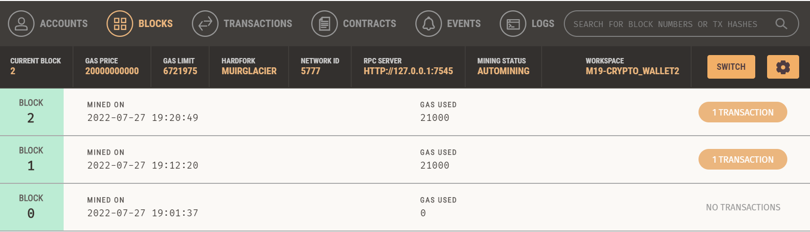
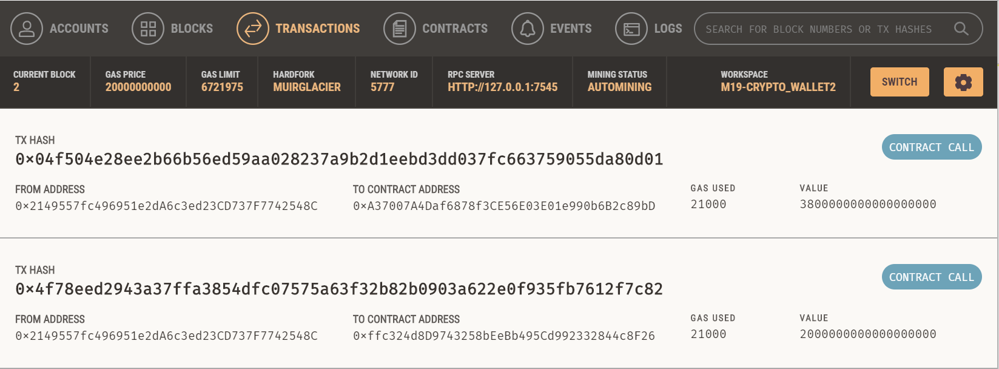
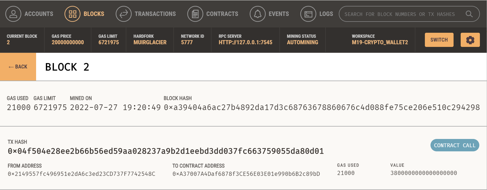
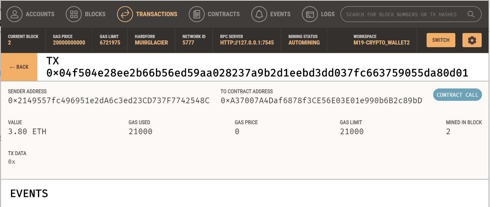

# M19-Crypto_Wallet 


*"Developing a Blockchain ledger for financial transactions with counterparty financial institutions for data verification."* 


## Background 

Working at a startup that is building a new and disruptive platform called Fintech Finder. It is an application that customers can use to find fintech professionals from among a list of candidates, hire them, and pay them. As Fintech Finder’s lead developer, the task is to integrate the Ethereum blockchain network into the application, in order to enable customers to instantly pay the fintech professionals whom they hire with cryptocurrency.

The code enables customers to send cryptocurrency payments to fintech professionals. To develop the code and test it out, assume the perspective of a Fintech Finder customer who is using the application to find a fintech professional and pay them for their work. 

---
## Evaluation Results

Review the transaction hash code associated with the validated Ethereum blockchain transaction.  In the 'Block' and 'Transaction' sections of Ganache menu bar are the reviews blockchain transaction details. Confirms of successfull transactions, are in the screenshots below:  
#### *Notice - All transactions refer to 2nd Block for Jo; 1st transaction of 2.0 `eth` made to account in previous workspace. Confirms and addresses in Images folder from previous workspace.*

3. On the resulting webpage, select a candidate that you would like to hire from the appropriate drop-down menu. Then, enter the 'Number of Hours' that you would like to hire them for: 


4. Click the 'Send Transaction' button to sign and send the transaction with your Ethereum account information. Navigate to the Transactions section of Ganache: 


- Take a screenshot of your address balance and history on Ganache. Save this screenshot to the README.md file of your GitHub repository for this Challenge assignment: 
 

- *added Blockchain transactions history:*
 

- Take a screenshot of the transaction details on Ganache. Save this screenshot to the README.md file of your GitHub repository for this Challenge assignment: 
 

- *added Block 2 transaction ledger details for Jo:* 



5. Return to the original transaction, and click the transaction’s To address.
- Take a screenshot of the recipient’s address balance and history in the Ganache application. Save this screenshot to the README.md file of your GitHub repository for this Challenge assignment.

 

---
## Technologies

The software operates on 'python 3.9' with the installation package imports embedded with 'Anaconda3' installation. The application was developed in 'VSCode 1.69.2', using 'Granache 2.5.4' and 'Streamlit v1.10.0'. Below are installation sites and libraries for imported tools to run the program. The application for GUI uses 'Streamlit' to create and run the blockchain transactions, ledgers and validations. 


---

## Installation Guide

Before running the applications open your terminal to install and check for your installations. First navigate to the download instructions using the links below. Then verify if the installations have been completed. 

1. Install Anaconda and create your environment; `python` should be installed with Anaconda:
* [python](https://www.python.org/downloads/) 

2. Verify version in the terminal enter command `python` for information or download:
* [anaconda3](https://docs.anaconda.com/anaconda/install/windows/e) 

3. Install Visual Studio Code, or VS Code, IDE to write the program & run it in Streamlit app: 
* [VSCode](https://code.visualstudio.com/download)

4. Install Ganache to setup a local blockchain to test and develop smart contracts in a local environment.: 
* [Granache](https://trufflesuite.com/ganache/) 

5. Install Streamlit to run the python code for the Blockchain Ledger in a GUI as a shareable web app: 
* [streamlit](https://docs.streamlit.io/library/get-started/installation)


```
python libraries
pip install web3==5.17                          # connects and performs operations on Ethereum-based blockchains
pip install eth-tester==0.5.0b3                 # provides access to the tools to test Ethereum applications
pip install mnemonic                            # generates BIP-39 standard 12 or 24-word mnemonic seed phrases
pip install bip44                               # derives hierarchical deterministic wallets from a seed phrase
```
libraries and modules for crypto_wallet.py:
```
import os                                       # allows extraction of the environment variable `mnemonic`
import requests                                 # allows HTTP requests in order to send response data
from dotenv import load_dotenv
load_dotenv()                                   # loads the `mnemonic` seed phrase in the `eth` environment
from bip44 import Wallet                        # secured storage of private keys in HD wallet for crypto Tx's
from web3 import Account                        # Python function for accessing latest blockchain ledger info
from web3 import middleware                     # manages communication between the program and the Ethereum client
from web3.gas_strategies.time_based import medium_gas_price_strategy          # transaction mined within 5 minutes 
```
libraries and mdules for fintech_finder.py: 
```
import streamlit as st                              # Python library for building web interfaces for Python apps    from dataclasses import dataclass
from typing import Any, List
from web3 import Web3                               # a SDK library that allows communication between Ethereum nodes
w3 = Web3(Web3.HTTPProvider('HTTP://127.0.0.1:7545'))   # connects to Web3 and Mnemonic provider Ganache  blockchain
```

---

## Usage

This application is launched from the VSCode terminal utilizing the above imported Python libraries and tools. The program is developed in VSCode using python language **.py** file to build the `cypto_wallet` and the `fintech_finder` files. `Web3` allows remote procedure call(RPC) to facilitate connection with the `crypto_wallet` and the Ethereum Blockchain network in Granache. The user of the program application operates through the Streamlit web app that provides functionality to create an Ethereum transaction and perform the following: 

### 1. Generate a new Ethereum account instance by using the mnemonic seed phrase provided by Ganache. 
- open up Ganache to create the ethereum block chain environment and add the `mnemonic` seed phrase into the 'Fintech Finder' Application's `.env` text file. 

### 2. Fetch and display the account balance associated with the Ethereum account address. 

- open up the terminal to the project file folder and create the Conda `eth` environment. 
- navigate to the project folder that contains the `.env` file and the `fintech_finder.py` and `crypto_wallet.py` files.
- launch the Streamlit application, type `streamlit run fintech_finder.py` in the terminal. 

### 3. Calculate the total value of an Ethereum transaction, including the gas estimate, that pays a Fintech Finder candidate for their work. 

- on the Streamlit webpage, select a candidate that you would like to hire from the appropriate drop-down menu; then, enter the number of hours you would like to hire them.
- after selecting the candidate with number of hours for hire, the total wage in `ether` is calculated in the Streamlit sidebar below their digital address. 

### 4. Digitally sign a transaction that pays a Fintech Finder candidate, and sends this transaction to the Ganache blockchain.blocks, perform the proof of work consensus protocol, and validate blocks in the chain. 

 - click the 'Send Transaction' button to sign and send the transaction with your Ethereum account information. If the transaction is successfully communicated to Ganache, validated, and added to a block, a resulting transaction hash code will be written to the Streamlit application sidebar.

- Navigate to the Ganache menu bar in the upper left to select 'Blocks' and then the 'Tranactions' pages to get transaction details.  

- for additional activity details of Blockchain ledger transaction info, navigate and press the 'Logs' button. 


```
python 
crypto_wallet.py
fintech_finder.py 

```
 

---

## Contributors

*Provided to you by digi-Borg FinTek*, 
Dana Hayes: nydane1@gmail.com

---

## License
Columbia U. Engineering 
--
[BSD 2-Clause LicenseCopyright (c) 2022, digi-Borg
All rights reserved.](/LICENSE)